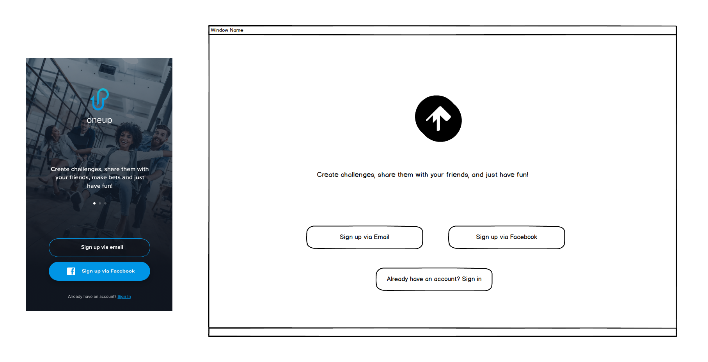
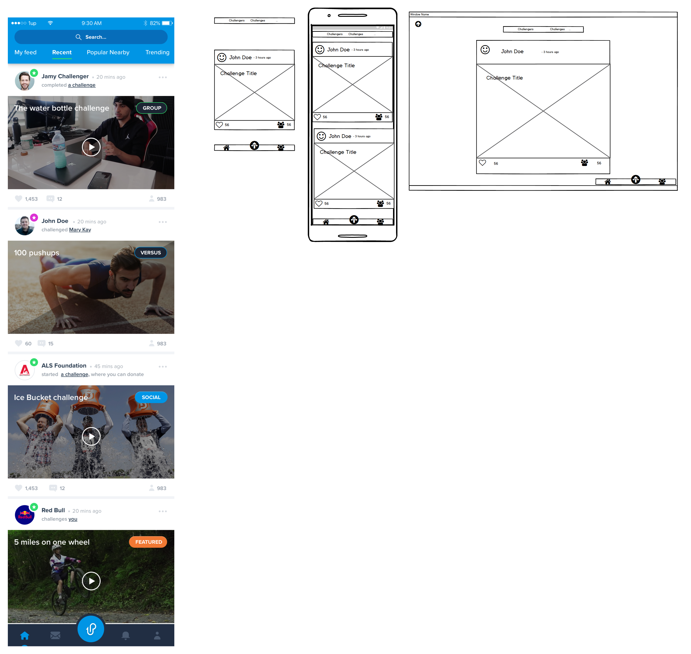

# READ ME

# OneUp MVP

### App URL
  * http://1up-app.s3-website-ap-southeast-2.amazonaws.com/

### Github
  * Front-End (React): https://github.com/Tyson652/MERN_react
  * Back-End (Node): https://github.com/Tyson652/MERN_express

## Description
  ### Problem definition / purpose
  The aim of OneUp is to create a Social Media app that revolves around companies or users uploading challenges, where users can then join and partake in the challenge. These challenges are videos where the users are challenged to complete a specific task. If a user wishes to partake in a challenge, they can then upload a video of themselves completing the challenge. These submissions are then added to the users profile and can be shared with other users. The purpose of our project was to build a working MVP application that contained the basic functionality needed for the app. This MVP could then be shown to investors, and future developers as a way of presenting the app and showing how it would work.

  <!-- * The build a MVP of Social Media app revolving around videos of users doing challenges. The purpose of the MVP is to get a working application in front of users and investors.  -->

  ### Functionality / features
  For our MVP we needed to implement the core functionality for our Social Media app. This included user accounts, and a profile page to keep track of their submissoins and edit their account information. Authorisation and Authenticaton so users can log in and sign up to create an account. Video file uploading and streaming so users can upload and view challenges and submissions. There is a Newsfeed page so users can view all the most recent submissions uploaded by other users, as well as a challenge page so they can view all the most recnt challenges. They can then view a challenge in more detail by clicking on the "View More Challenge Details", which will show the callenge and all the submissions that have been submitted for that challenge. Challenges and submissions can eaisly be shared on Facebook, Twitter or Tumbler by clicking on the share icon. The app can be used by both users with accounts or by visiting guests, the difference being guest will not have their own profile page and will be unable to make submissions to challenges.

  <!-- * Video file uploading
    * Video streaming
    * User accounts
    * Admin created challenges -->

  ### Screenshots

  ### Tech stack 
  The OneUp MVP was made with the MERN stack. On the Front-end we used React, with the code being written in Javascipt, JSX and CSS. Material Ui was used for styling the different components and the YouTube API was used for streaming the videos. For the Back-end we used Node and Express, MongoDB used used for our database and the YouTube API was used for uploading the videos. Github was used for source control and the application was deployed on AWS.

  <!-- * Front-end
      * React
      * YouTube API
    * Back-end
      * Node + Express
      * MongoDB
      * YouTube API -->

  <!-- * Instructions on how to setup, configure, deploy and use your App. -->

  ### Instructions
  When a user first visits our site, they are a guest will be taken to the Newfeed page, where they will be able to view all the most recent submissions uploaded by other users. They will also be able to view the most recent challenges by clicking on the Challenges button. The will also be able to view a challenge and see all the sumbissions made to that challenge. However as they are a guest they will be unable to make their own submissions. If they try they will be redirected to the landing page where they will be able to log in by clicking "log in" if they already have an account or they can register by clicking "sign up", if they wish to create an account. Once a user is signed in they will be able upload there own subissions to challenges by clicking "Join Challenge" and they have access to their own profile page which will now be avaiable in the navigation bar. Once on the profile page a user will be able to edit their account information and upload a profile photo by clicking on the "Edit Profile" link in the navigation bar.

## Design Documentation
  ### Design Process
  The design process was pretty straight foward as our client OneUp already had a styled mockup of the mobile version of the app. We used this when it came to making our design decisions and we tried to get our design as close to the mockup as possible. We created some wireframes for the web version of our app and kept the design very similar to the mobile version. For our styling libary we decided to use Material Ui as we liked the way it looked and it was easy to implement.

  ### User stories
  * As a user, I want to create an account to save relevant information and my submissions.
  * As a user, I want to be able to change my account details.
  * As a user, I want to be able to see all the most recent submissons from other users.
  * As a user, I want to be able to see all the most recent challenges.
  * As a user, I want to be able to make a new submission to a challenge.
  * As a user, I want to be able to share my submissions on other social media applications.
  * As a user, I want to be able to view a challenge and all the submissions made to that challenge.
  * As a user, I want to be able to delete my submissions.
  * As a user, I want to be able to log in and sign out of my account.
  * As a user, I want to be able to view the site even if I don't have an account.

### Workflow Diagram

### Wireframes
#### Landing Page

#### Login Page

#### Register Page

#### Challenge Page

  
  * Wireframes
    * Balsamiq
  * Database Entity Relationship Diagrams
  * Data Flow Diagram
  * OO design documentation

* Details of Project Management & Planning process including,
  * Project plan & timeline
  * Client communications
  * Screenshots of Trello board(s)

* Answers to the Short Answer questions (Section 2.2)
  * What are the most important aspects of quality software?
    * Single responsibility principle / Separation of Concerns
    * Composability
    * Testability
    * DRY
    *
    *

  * What libraries are being used in the app and why?
    * Express - server
    * Mongoose - wrapper around MongoDB
    * Passport - authentiction and authorization
    * Passport-local-mongoose -
    * jsonwebtoken - used to generate JWT
    * Celebrate - middleware for validating incoming data
    * Multer - middleware for handling form data, used to handle file types
    * aws-skd - create S3 instances
    * Nodemailer - used to send emails

    * React - front end library for building single page applications
    * React-route-dom - handling routing with web application
    * React-player - video playback
    * Redux - manages global state store
    * Redux-form - manage form state
    * Axios - handles HTTP 
    * Redux-thunk - extends Redux Actions by handling functions instead of just objects
    * Material UI - styling library

    * Jest - testing library (front end and back end)
    * Supertest - used for creating a back end environment for testing
    * Enzyme - front end testing
 
  * A team is about to engage in a project, developing a website for a small business. What knowledge and skills would they need in order to develop the project?
    * Design (UX/UI: user stories, wire frames, user flow, mock ups, )
    * Development (front-end, back-end, database design, version control, testing, operations)
    * Project Management

  * Within your own project what knowledge or skills were required to complete your project, and overcome challenges?
    * MERN tech stack
    * file uploads (images and video)
    * video playback
    * Deployment (Heroku, MongoDB Atlas, AWS S3)

  * Evaluate how effective your knowledge and skills were this project, using examples, and suggest changes or improvements for future projects of a similar nature?