# READ ME

# OneUp MVP

### App URL
  * http://1up-app.s3-website-ap-southeast-2.amazonaws.com/

### Github
  * Front-End (React): https://github.com/Tyson652/MERN_react
  * Back-End (Node): https://github.com/Tyson652/MERN_express

## Description
  ### Problem definition / purpose
  The aim of OneUp is to create a Social Media app that revolves around companies or users uploading challenges, where users can then join and partake in the challenge. These challenges are videos where the users are challenged to complete a specific task. If a user wishes to partake in a challenge, they can then upload a video of themselves completing the challenge. These submissions are then added to the users profile and can be shared with other users. The purpose of our project was to build a working MVP application that contained the basic functionality needed for the app. This MVP could then be shown to investors, and future developers as a way of presenting the app and showing how it would work.

  <!-- * The build a MVP of Social Media app revolving around videos of users doing challenges. The purpose of the MVP is to get a working application in front of users and investors.  -->

  ### Functionality / features
  For our MVP we needed to implement the core functionality for our Social Media app. This included user accounts, and a profile page to keep track of their submissoins and edit their account information. Authorisation and Authenticaton so users can log in and sign up to create an account. Video file uploading and streaming so users can upload and view challenges and submissions. There is a Newsfeed page so users can view all the most recent submissions uploaded by other users, as well as a challenge page so they can view all the most recnt challenges. They can then view a challenge in more detail by clicking on the "View More Challenge Details", which will show the callenge and all the submissions that have been submitted for that challenge. Challenges and submissions can eaisly be shared on Facebook, Twitter or Tumbler by clicking on the share icon. The app can be used by both users with accounts or by visiting guests, the difference being guest will not have their own profile page and will be unable to make submissions to challenges.

  <!-- * Video file uploading
    * Video streaming
    * User accounts
    * Admin created challenges -->

  ### Screenshots
  #### Login Page
  
  #### Register Page
  
  #### Newsfeed Page
  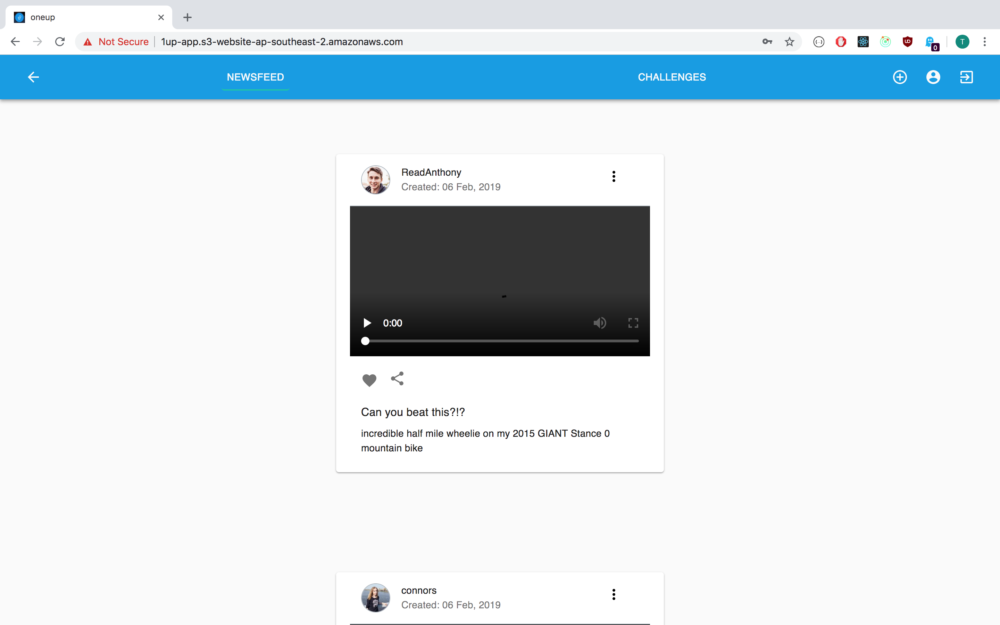
  #### Challenge Page
  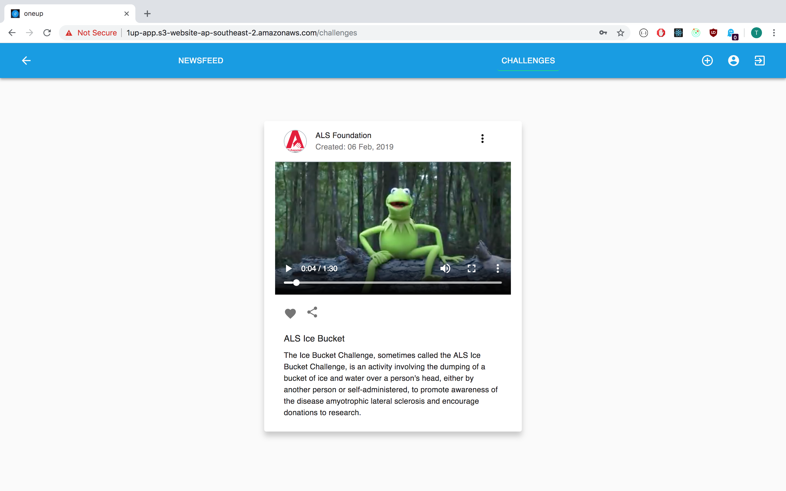
  #### Create Challenge Page
  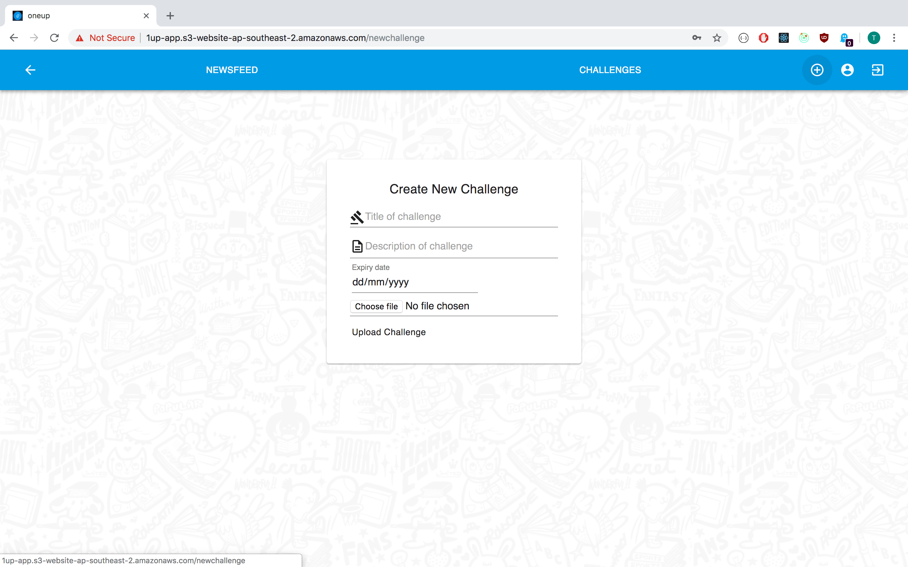
  #### Profile Page
  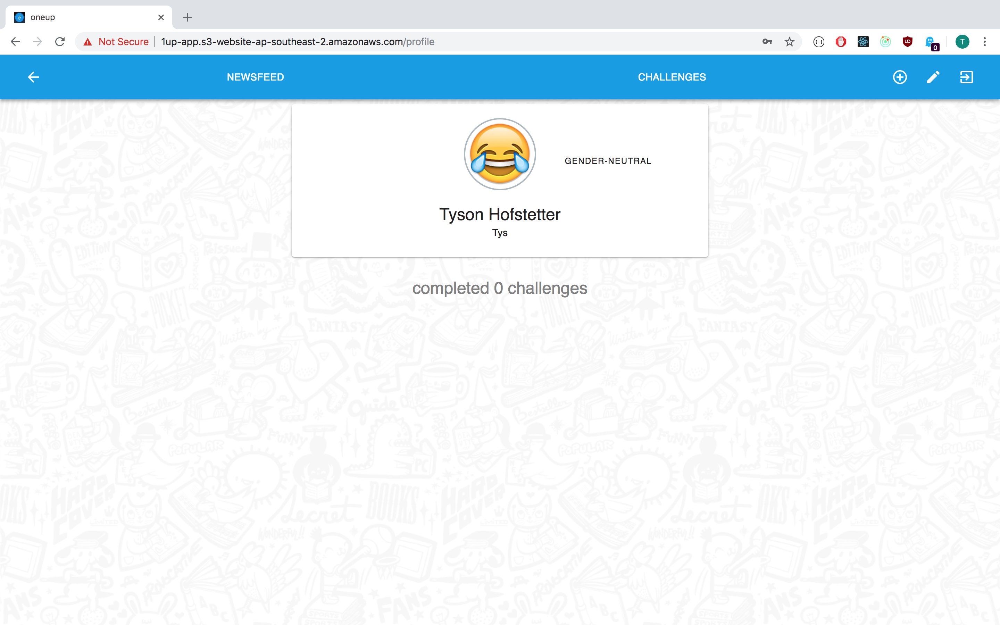
  #### Edit Profile Page
  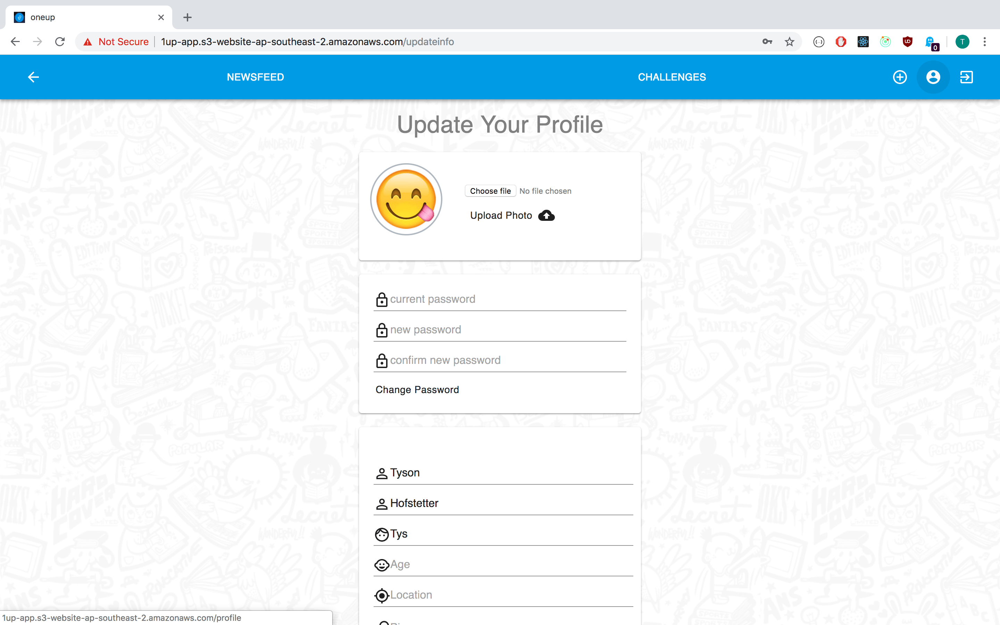

  ### Tech stack 
  The OneUp MVP was made with the MERN stack. On the Front-end we used React, with the code being written in Javascipt, JSX and CSS. Material Ui was used for styling the different components and the YouTube API was used for streaming the videos. For the Back-end we used Node and Express, MongoDB used used for our database and the YouTube API was used for uploading the videos. Github was used for source control and the application was deployed on AWS.

  <!-- * Front-end
      * React
      * YouTube API
    * Back-end
      * Node + Express
      * MongoDB
      * YouTube API -->

  <!-- * Instructions on how to setup, configure, deploy and use your App. -->

  ### Instructions
  When a user first visits our site, they are a guest will be taken to the Newfeed page, where they will be able to view all the most recent submissions uploaded by other users. They will also be able to view the most recent challenges by clicking on the Challenges button. The will also be able to view a challenge and see all the sumbissions made to that challenge. However as they are a guest they will be unable to make their own submissions. If they try they will be redirected to the login page where they will be able to log in if they already have an account or if they don't have an account they can create one by clicking "sign up" and filling out the form on the sign up page. Once a user is signed in they will be able upload there own subissions to challenges by clicking "Join Challenge" and they have access to their own profile page which will now be avaiable in the navigation bar. Once on the profile page a user will be able to edit their account information and upload a profile photo by clicking on the "Edit Profile" link in the navigation bar.

## Design Documentation
  ### Design Process
  The design process was pretty straight foward as our client OneUp already had a styled mockup of the mobile version of the app. We used this when it came to making our design decisions and we tried to get our design as close to the mockup as possible. We created some wireframes for the web version of our app and kept the design very similar to the mobile version. For our styling libary we decided to use Material Ui as we liked the way it looked and it was easy to implement.

  ### User stories
  * As a user, I want to create an account to save relevant information and my submissions.
  * As a user, I want to be able to change my account details.
  * As a user, I want to be able to see all the most recent submissons from other users.
  * As a user, I want to be able to see all the most recent challenges.
  * As a user, I want to be able to make a new submission to a challenge.
  * As a user, I want to be able to share my submissions on other social media applications.
  * As a user, I want to be able to view a challenge and all the submissions made to that challenge.
  * As a user, I want to be able to delete my submissions.
  * As a user, I want to be able to log in and sign out of my account.
  * As a user, I want to be able to view the site even if I don't have an account.

### Workflow Diagram

### Wireframes
#### Login Page
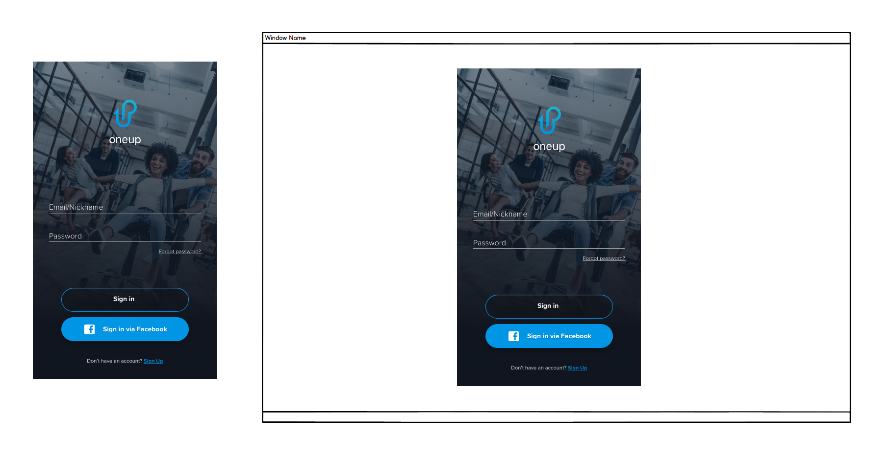
#### Register Page

#### Challenge Page
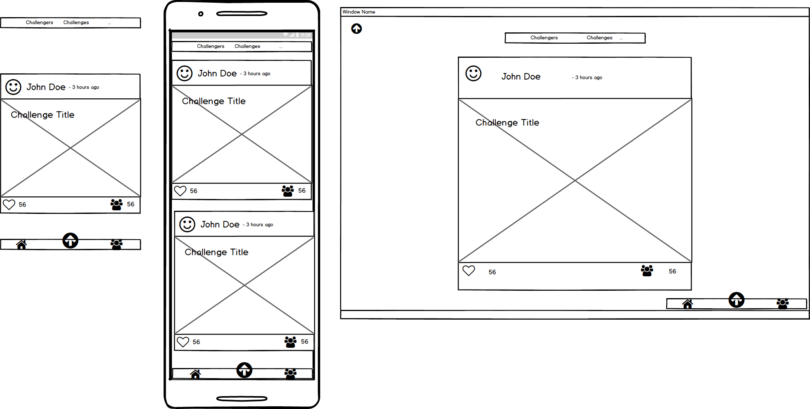
#### Current Challenge Page
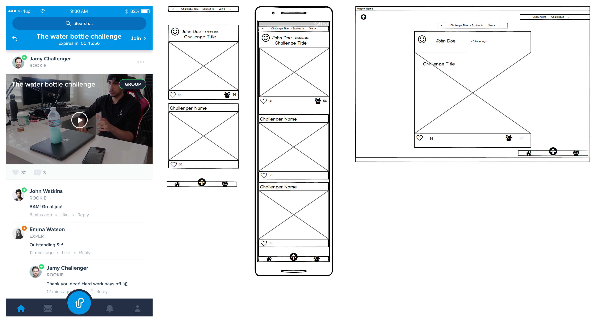
#### Create Challenge Page
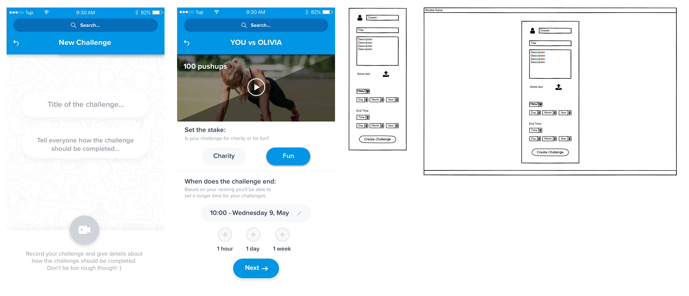
#### Profile Page
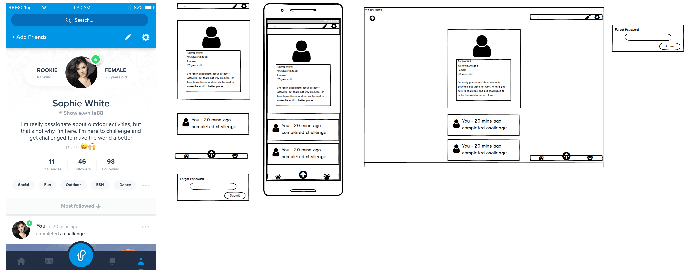

### Database Entity Relationship Diagram
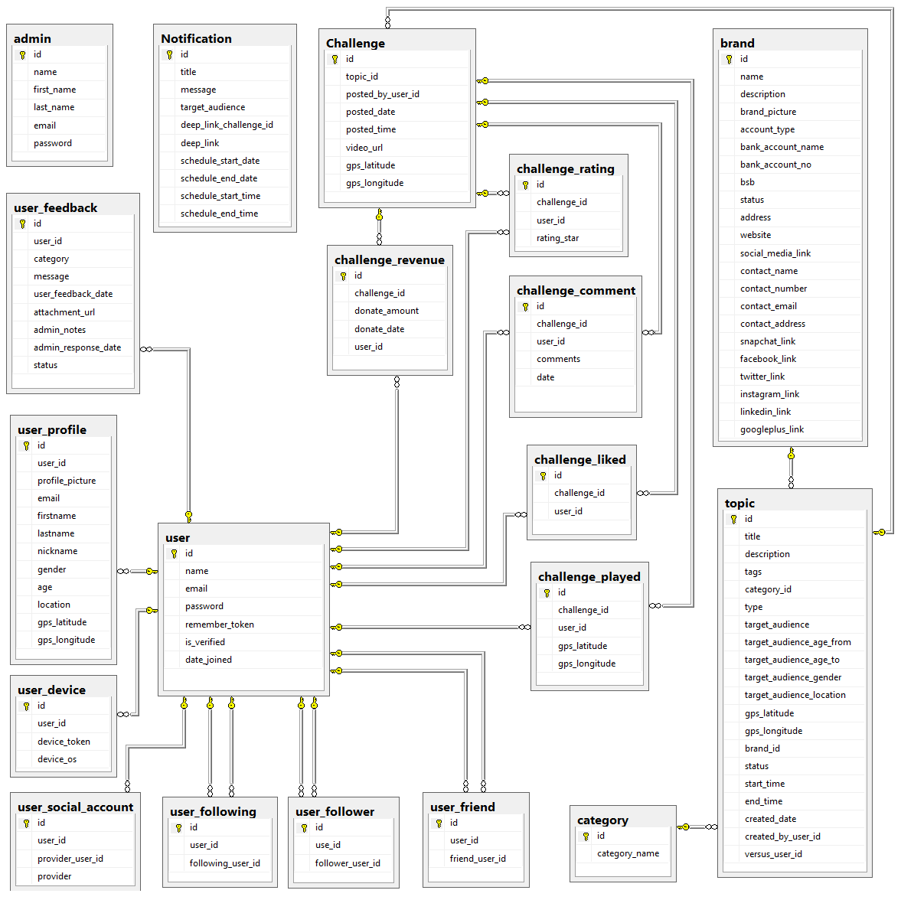
  
### Data Flow Diagram
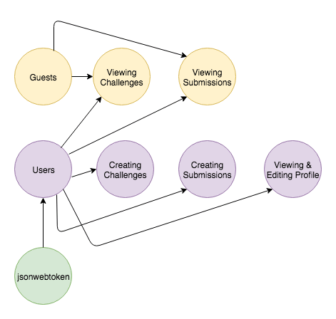

  <!-- * OO design documentation -->

## Project Management & Planning
  ### Project plan & timeline
  After having meetings with two possible clients we decided to go with OneUp as our client. We spent the first couple of days looking over the documentation supplied to us by Leanne from OneUp and planning how we would build the app. We built a trello board, worked on the website versions of the wirefames and planned the schemas for our databases. We kept in contact with Leanne as we planned the app and they where able to help us if we had any questions relating to the app design. We had a little under four weeks to build our MVP. Our first week was spent finding a client, planning the app and then starting coding. In our second week we continued coding and we aimed to get the main functionality of our app working by the end of the second week. By the third week most of the main fuctionality of our app was working so we continued working on the main features as well as adding in some new ones. The fourth and last week was mainly spent on styling the app and getting it ready to be presented to our client.  

  ### Client communications
  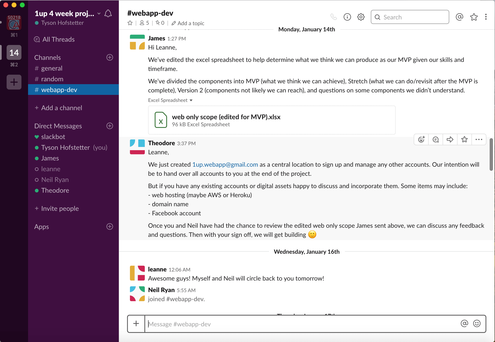
  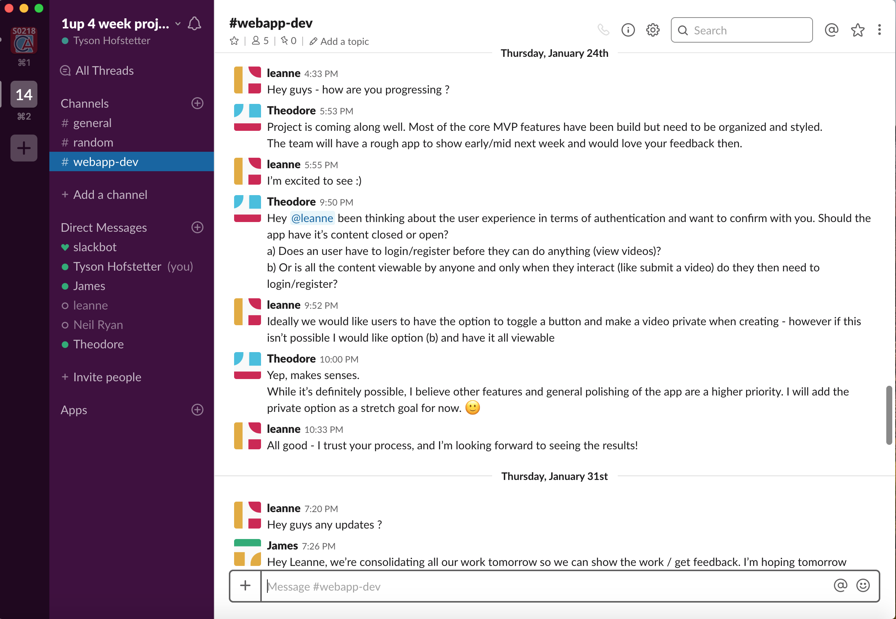

  ### Trello boards
  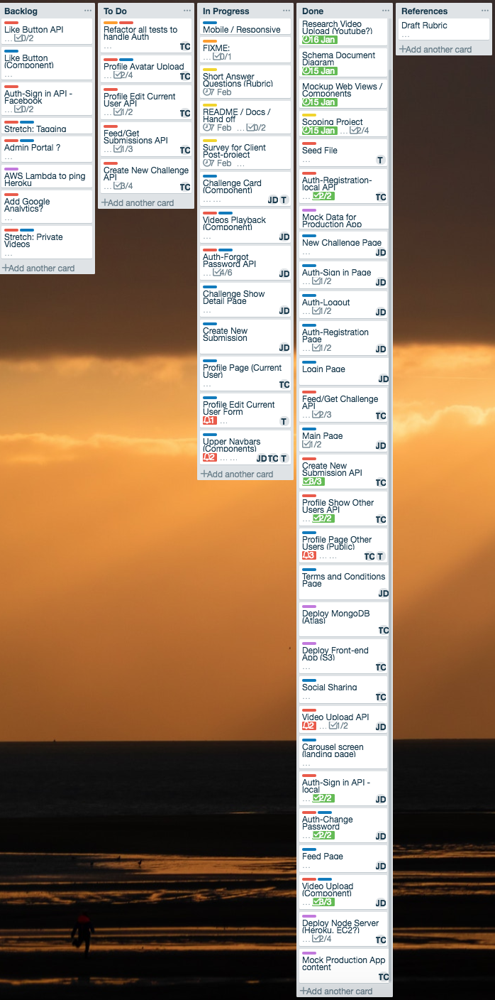
  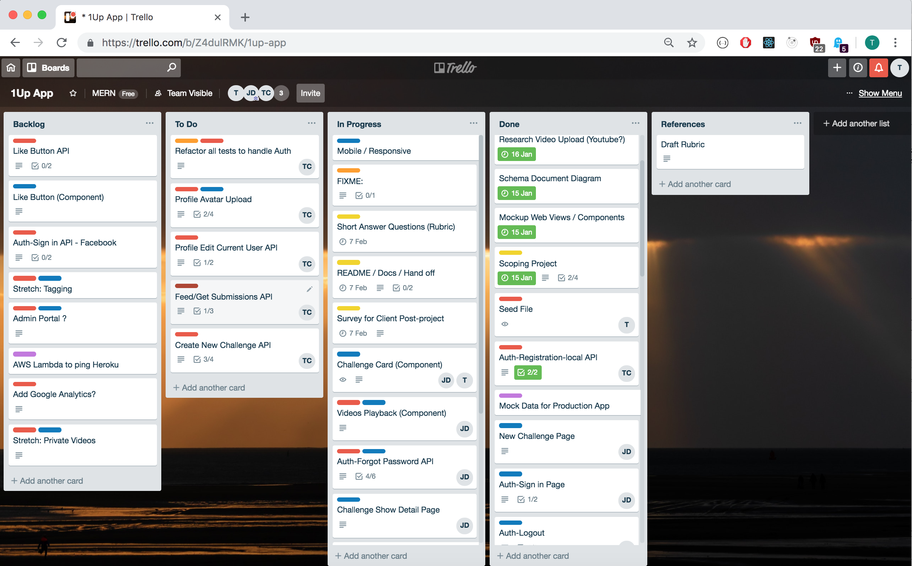

## Answers to the Short Answer questions (Section 2.2)
  ### What are the most important aspects of quality software?
  One of the most important aspects of software is it's usability. The software needs to be able to fulfill the needs of the customer by working in the way it is intended and in a way that the customer can use easily. Quailty code is also incredibly important as this allows the code to work effeciantly, and also to be easily worked on and updated in the future. Quality code has a clear and understandable design, it is "dry" code that does not repeat it's self and makes use of the single responsibility principle. It is easily extended and bulit upon and has a well defined interface. It has been tested extensively and has clear documentation and comments.

   <!-- * Single responsibility principle / Separation of Concerns
    * Composability
    * Testability
    * DRY
    *
    * -->

  ### What libraries are being used in the app and why?
  * Express - server
  * Mongoose - wrapper around MongoDB
  * Passport - authentiction and authorization
  * Passport-local-mongoose -
  * jsonwebtoken - used to generate JWT
  * Celebrate - middleware for validating incoming data
  * Multer - middleware for handling form data, used to handle file types
  * aws-skd - create S3 instances
  * Nodemailer - used to send emails

  * React - front end library for building single page applications
  * React-route-dom - handling routing with web application
  * React-player - video playback
  * Redux - manages global state store
  * Redux-form - manage form state
  * Axios - handles HTTP 
  * Redux-thunk - extends Redux Actions by handling functions instead of just objects
  * Material UI - styling library

  * Jest - testing library (front end and back end)
  * Supertest - used for creating a back end environment for testing
  * Enzyme - front end testing
 
### A team is about to engage in a project, developing a website for a small business. What knowledge and skills would they need in order to develop the project?
In order to develop the project they would need the core skills of strategy and planning, in order to effectivly plan how they are going to build the website, what web technologies will be used, how the work will be distributed among the team and how long the project will take. Project managment is also very important so everyone in the team is aware of the roles and is held accoutable for the work they do, and that the work being done is correct and will deliver real value for the client. They would also need all the necessary technical skills and knoweldge of web technologies to build the website. This would involve a strong knowledge of Web Development (front-end, back-end, database design, version control, testing, operations) and Design (UX/UI: user stories, wire frames, user flow, mock ups). 

### Within your own project what knowledge or skills were required to complete your project, and overcome challenges?
To complete our project our team required a knowledge of the MERN stack. This involved a knowledge of React, Node, Express and MongoDB. Using these frameworks also required knowledge of coding langauges such as JavaScript, CSS, HTML, and JSX. A knowledge of uploading images and videos was requied as was a knoweldge of how API's work. This along with the skill of being able to learn new technologies, helped us overcome the challenge of implementing the YouTube API in our site, which allowed us to stream and upload videos. Our knowledge of coding libraries also proved very important as we used many different libraries in the development of our site. Libraries such as Passport, Material UI, jsonwebtoken, Mongoose, celebrate, etc where all imporant and each helped to fill a role in the creation of our site. Skills and knowledge when it came to the deployment of our site was also important. Heroku, MongoDB Atlas and AWS S3 where all used and where each important in overcoming the challenge of depolying our website. Having skills relating to web design, such as CSS and UI also proved important when it came to styling our site and creating the fished design.

### Evaluate how effective your knowledge and skills were this project, using examples, and suggest changes or improvements for future projects of a similar nature?
As a team we each managed to fill a role in the creation of our site. Around the begining of our project we each took on different role, Theo working on the Back-end, Tyson working on the Front-end and James working on the YouTube API. But as our project progressed the roles changed a bit become a bit less defined. People started taking on different tasks that required a knowledge of the other parts of the site that had been built by the other group members. This required the team members to move away from the part of the site they had been focusing on and learn about the other parts in order to implement new features. An example of this is when Tyson, who had primarily been working on the front end had to hook a form up to the Back-end created by Theo. A possible improvement to our workflow might have been to go through each others work together, so we each had a understanding of what the other team members had done. This would have then made it a bit easier when it came to working on different parts of the site that we were each unfamiliar with. However a drawback to this approch would be that it would have taken more time away from coding, and that some features, such as the YouTube API were quite complex, so teaching it to another group member could have taken up quite a bit of time.